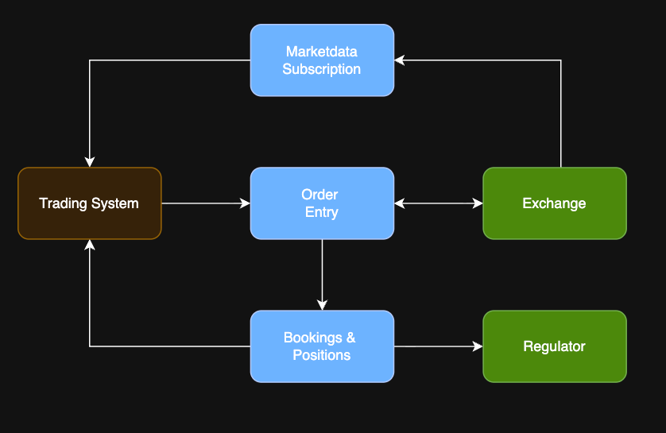
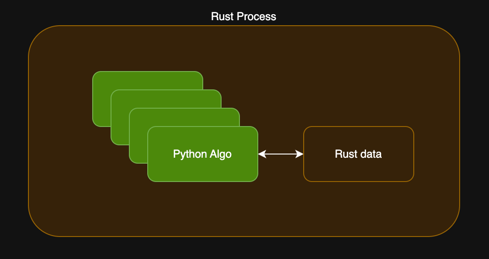
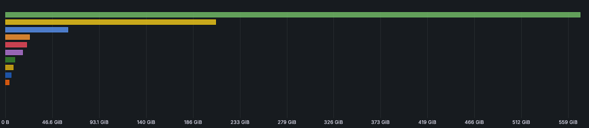
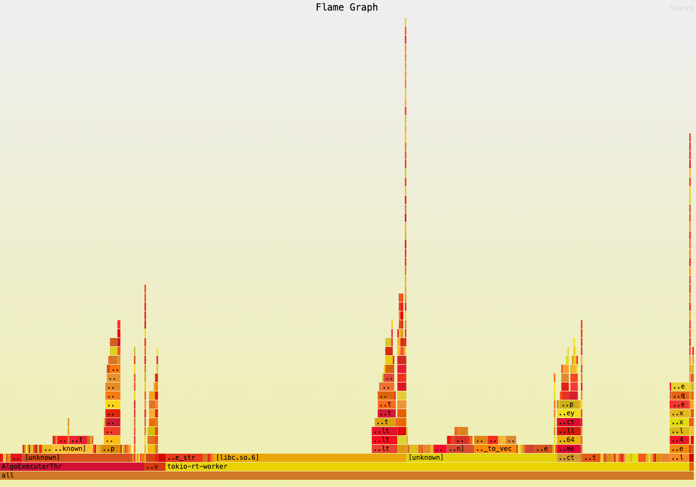
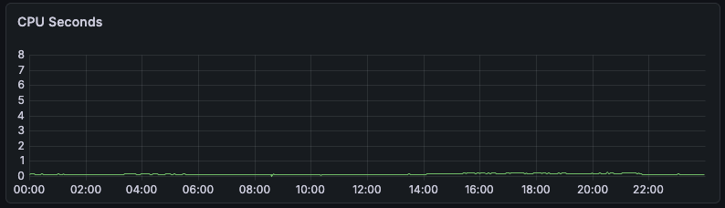
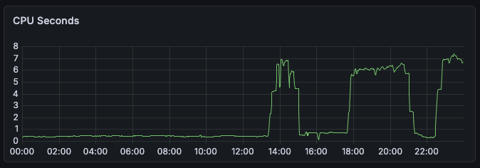

---
theme:
  name: light
  override:
    code:
      theme_name: "GitHub"
    footer:
      style: template
      left:
        image: ./assets/mft.png
      center: '**<span class="r">RUST</span>** in <span class="mft">PRODUCTION</span> <span class="r"></span>'
      right: "{current_slide} / {total_slides}"
      height: 3
    palette:
      classes:
        r:
          foreground: "AF2F0D"
        py:
          foreground: "636B2F"
        dir: 
          foreground: red 
        prod: 
          foreground: blue
        price:
          foreground: cyan 
        unit:
          foreground: magenta
        mft:
          foreground: "ff7d23"
---
<!-- no_footer -->

<!-- newlines: 3 -->


<!-- font_size: 2 -->
<!-- alignment: center -->
An experience report

<!-- alignment: center -->
<!-- font_size: 2 -->
 🦀❤️
<!-- font_size: 1 -->

<!-- alignment: center -->

## <span class="r">_**Thomas Fisker Christensen**_</span>

### <span class="mft">tfc@mft-energy.com</span>

<!-- end_slide -->

Agenda
===

# <span class="r">Rust</span> at <span class="mft">MFT Energy</span>

## Why

### Context: Energy trading 🔌🔋 + <span class="py">Python</span> 🐍

### Requirements

## What we built

## Successes

## Challenges

About me
===

```json
{
  "age": 45,
  "work_location": "Aarhus, Denmark",
  "employer": "MFT Energy",
  "role": "Senior Software Engineer",

  // private
  "location": "Silkeborg",

  "interests" : [
     "rust",

     "keyboard focused workflows",
     "terminal",
     "neovim",
     "nixos",

     "staying fit and healthy"
  ]
}
```

Energy Trading Overview
===

<!-- newlines: 5 -->

# exchange
<!-- newlines: 2 -->
<!-- pause -->

# order

> I want to <span class="dir">sell</span> <span class="mft">4.2 MWh</span> of <span class="prod">Hour 17 Power</span> for <span class="price">50</span> <span class="unit">EUR/MWh</span>

## each product has an order book collecting bids and asks

<!-- pause -->

<!-- newlines: 2 -->
# trade

## occurs when bid and ask match

Highlevel Context
===

<!-- column_layout: [1, 1] -->

<!-- column: 0 -->

<!-- column: 1 -->
<!-- list_item_newlines: 1 -->

# WHAT

- Algo trading
- Internal Users
- Algo devs are <span class="py">Python</span>istas

# HOW

- Aspiration: 100% uptime and reliability
- Latency matters
- Logic errors are costly

# WHY

- Existing solution from 3rd party had issues
  - crashes
  - performance (5s queue lag in peak hours)
  - single exchange
  - rigid and hard to customize

Why <span class="r">Rust</span>?
===

<!-- newlines: 4 -->

# Python

- using `PyO3` simple hosting of <span class="py">Python</span> in <span class="r">Rust</span> - and _vice versa_

# Performance and latency

- very good performance/resource utilization
- predictable low latency (no GC pause)

# Safety

- good safety guarantees (memory and threads)
- explicit types and error handling (no accidental coercions or silent bugs)

What we provide
===

<!-- column_layout: [1, 1] -->

<!-- column: 0 -->

```python
# main.py
def initialize(
    lb: LazerBridge,
    json_config: str) -> None:
  pass

def on_orderbook_changed(
    lb: LazerBridge, 
    config: Config, 
    contract: ContractIdentifier) -> None:
  pass

def on_timer(
    lb: LazerBridge, 
    config: Config) -> None:
  pass

def on_algo_trade(
    lb: LazerBridge, 
    config: Config, 
    trade: Trade) -> None:
  pass
```

<!-- column: 1 -->



```
# requirements.txt
numpy==2.4.4
pandas==3.0.1
py-lazer-trader~=1.7.2
```

```python
class LazerBridge:
    def place_order(self, order: OwnOrder):
      ... 
    # update(), delete() etc 
```

Public Ecosystem
===

- `serde` + `serde_json`: king of serialization 👑   `FE → P → BE`
- `tokio`: ubiquitous async runtime 🏃‍♂️ (channels, tasks, timers, `select!`)
- `axum` + `reqwest`: http server and client 🌐
- `pyo3`: snek interop 🐍
- `nextest`: clever test runner 🧪 (separate processes)
- `chrono`: time handling 🕰️ (`DateTime<Utc>, NaiveDate, NaiveTime`)
- `thiserror`: simple typed errors 🐞
- `tracing`: logs 🪵
- `opentelemetry-*`: metrics 📊
- `azure_*`: ☁️
- `config`: layered configuration 🎛️
  - default.toml -> production.toml -> env vars

👑 serde + serde_json 👑
===

# Filter and pass-through - À la carte

## Frontend -> Proxy -> Backend

<!-- pause -->

<!-- column_layout: [1, 1] -->
<!-- column: 0 -->
```json
{ // Algo object
  "state": {
    "message": "",
    "state": "Running", // <- picked
    "trade_quantity": 2.3
  }

  "subscriptions": [ 
    // <- ignored and not serialized
  ],

  // everything below is included
  "algo_data": { "direction": "BUY", 
    "quantity": { "kilo_watts": 3600 } 
  },
  "algo_id": "abcdef",
  "configuration": {
    // ...
  },
  "start": "2026-04-20T08:35:00Z",
  "end": "2026-04-20T14:45:00Z",
  "exchange": "EPEX",
}
```

<!-- pause -->
<!-- column: 1 -->

```rust
#[derive(Debug, Clone, Serialize, Deserialize)]
pub struct Algo {
    pub state: AlgoState,

    #[serde(skip_serializing, default)]
    subscriptions: serde::de::IgnoredAny,

    #[serde(flatten)]
    fields: serde_json::Value,
}

#[derive(Debug, Clone, Serialize, Deserialize)]
pub struct AlgoState {
    pub state: String,

    #[serde(flatten)]
    fields: Value,
}
```

Observability
===

# We highly value observability and have invested in it from the start

- OpenTelemetry for collection and export
- grafana.com for backend and dashboards



# Logging for replay (backtesting)

- `historian` (disk -> blob storage)

# Compliance

- 5 years of data retention

🎉 Wins 🏆
===

# Delivered a working system 💪

# types and compiler as a safety net 🛡️

# analysing performance (flamegraph 🔥)

# xmllib (dotnet integration) 

# failure strategy

- `Let it crash!` (and resume to a known good state)

We delivered the result
===

Successfully replaced the existing 3rd party solution


> Phenomenal speed improvement, fun fact we had to slow down our execution algos to avoid depleting all our available OMT within 1-2 hours

Types and Compiler as a Safety Net
===

# Enums and patterns 💪

## `Result<T>` and `Option<T>` is superior to Exceptions and `null`s

> Failure is not an Option\<T\>
> It's a Result<T, E>

## Exhaustiveness checking

<!-- pause -->

# Strong types without primitive obsession

## No mixing Quantity and Price

<!-- column_layout: [1, 1] -->
<!-- column: 0 -->

```rust
#[derive(Debug, Clone, Copy,
  PartialEq, Eq,
  PartialOrd, Ord, 
  Serialize, Deserialize, 
  Hash)]
pub struct Price {
    price: i64,
}
```

<!-- column: 1 -->
```rust
#[derive(Debug, Clone, Copy, 
  PartialEq, Eq,
  PartialOrd, Ord, 
  Serialize, Deserialize, 
  Hash)]
pub struct Quantity {
    kilo_watts: u64,
}
```

Types and Compiler as a Safety Net
===

# Cheap and easy wrappers (zero cost abstractions)

<!-- column_layout: [1, 1, 1] -->

<!-- column: 0 -->
```rust
pub struct Timed<T> {
    time: Instant,
    inner: T,
}
```
<!-- column: 1 -->
```rust
impl<T> From<T> for Timed<T> {
    fn from(value: T) -> Self {
        Timed {
            time: Instant::now(),
            inner: value,
        }
    }
}

something.into() // Timed<TSomething>
```

<!-- column: 2 -->
```rust
impl<T> Deref for Timed<T> {
    type Target = T;

    #[inline]
    fn deref(&self) -> &T {
        &self.inner
    }
}

&timed_something // &TSomething
```

Types and Compiler as a Safety Net
===

# type driven development

- implement this trait (interface) to have an exchange

```rust
#[async_trait::async_trait]
pub trait Exchange: Send + Sync + 'static {
    async fn initialize(&self) -> Result<(), ExchangeError>;

    async fn get_contract_info(&self) -> Result<Vec<ContractInfo>, ExchangeError>;

    async fn get_order_books(
        &self,
        contracts: &[ContractInfo],
        ) -> Result<Vec<OrderBook>, ExchangeError>;

    async fn get_orders_snapshot(&self) -> Result<Vec<ExchangeOrderEvent>, ExchangeError>;

    async fn get_trades_for_period(&self, since: Timestamp) -> Result<Vec<LtTrade>, ExchangeError>;

    async fn get_public_trades_for_period(
        &self,
        since: Timestamp,
        ) -> Result<Vec<PublicTrade>, ExchangeError>;
}
```

Given / When / Then
===

# Typestate and fluent interfaces for clear test structure and readability

```rust
#[tokio::test]
async fn test_something() {
  let algo_id = AlgoId::generate_new();

  let world = World::given()
    // arrange
    .an_algo(AlgoRequest::mockd(algo_id).with_quantity(2.0))
    .when().await
    // act
    .a_contract_is_received(ContractInfo::mock())
    .then().await
    // assert
    .algo_has_placed_orders(algo_id, 1);

  world.run().await
}
```

<!-- list_item_newlines: 1 -->
# When run

- spins up lazer_trader instance exposing a http api
- sets up algos (via http)
- simulates market data
- validates system behavior

Performance Insights from Production
===

<!-- font_size: 3 -->
<!-- alignment: center -->
🔍 🏎️

🪄🦸‍♂️

<!-- pause -->
<!-- font_size: 2 -->

- attach to running system
- no instrumentation or interruption

`perf` + flamegraph-rs 🔥
===



Flamegraph HOWTO
===

<!--column_layout: [1, 1] -->
<!-- column: 0 -->
```docker
# builder stage
RUN cargo install --root /code flamegraph

# ...

# runner stage
COPY --from=base-builder /code/bin/flamegraph .
```

<!-- column: 1 -->
```toml
[profile.release]
debug = true # for symbols to be present
```

<!--column_layout: [1] -->
<!-- column: 0 -->

```bash
# shell on container
# cd to somewhere with enough diskspace and exposed outside

## attach to process id 1 and record until interrupted
/app_root/flamegraph -p 1
# produces a perf.data and flamegraph.svg

# for more control
# sample freq: 99 HZ
# process id: 1 
# -g: callgraph-mode (fp, dwarf, lbr)
# for 30 seconds
perf record -F 99 -p 1 -g -- sleep 30 
/app_root/flamegraph --perfdata perf.data
```

dotnet integration 
===

## Needed to sign XML documents for a legacy integration

<!-- pause -->

## No crate in <span class="r">Rust</span> supported the required XML signature standard

<!-- pause -->

# HOW

## `System.Security.Cryptography.RSAPKCS1SignatureFormatter`

## Static AOT compiled C# called from <span class="r">Rust</span> (C-calling conventions linking)

```rust
// xml-doc in 🦀 -> XML signing  -> signed xml-doc out 🦀
fn rusty_code(xml: &str) -> Result<String, &'static str> {
    /// ... 
    let res = unsafe {
        sign_xml_string( 
          xml.as_ptr(), xml.len() as i32,
          output_buffer.as_mut_ptr(), output_buffer.capacity() as i32,
        )
    };
    /// ... 
}
```

<span class="r">Rust</span> 🦀 Challenges 🥵
===
<!-- font_size: 2 -->

<!-- newlines: 3 -->
<!-- list_item_newlines: 3 -->

- `tokio` starvation (IO thread can be starved by CPU intensive tasks)
<!-- pause -->
- `select!` gone wrong in a tight `loop { }`
<!-- pause -->
- Continuous integration build times

`tokio` starvation
===

<!-- newlines: 4 -->

- in the standard `#[tokio::main]` multithreaded executor
  - thread per core
- **Cooperative** vs _preemptive_ _multitasking_

<!-- pause -->
- [CPU bound tasks](https://docs.rs/tokio/latest/tokio/index.html#cpu-bound-tasks-and-blocking-code)
- `block_in_place()` or `spawn_blocking()` to the rescue

A normal day in <span class="r">PRODUCTION</span>
===



CPU usage gone amok
===



# observations

## no one noticed ‼️⁉️❓

`select!` gone wrong
===

```rust
loop {
  tokio::select! {
    something = mpsc_rx.recv() => {
      // ...
    } 

    _ = timer_trigger.tick() => {
      // ...
    }


    // ... 229 lines of code in the same select! block
  }
}
```

<!-- pause -->

> Once all senders have been dropped and any remaining buffered values have been received, `Receiver::recv()` returns `None`...

<!-- pause -->


CI Build times
===

# merge to main  -> dev deploy

- currently ~35 mins
  - docker images (32 mins)
  - deployment (~30 sec per exchange)

- (on Github Runners)

# 🐘🦣 `target/` 4.5 GB

- caching is difficult

# good enough for now

LINKS QR
===

```bash +exec_replace +no_background
url="https://github.com/thomaschrstnsn/rust-in-production-talk-2026"
echo "$url"| qrencode -t utf8i
```

<!-- alignment: center -->
`https://github.com/thomaschrstnsn/rust-in-production-talk-2026`

<!-- font_size: 2 -->
Questions? 🤔❓❓
